---
## Front matter
lang: ru-RU
title: Лабораторная работа №1
subtitle: Информационная безопасность
author:
  - Павлова П.А.
institute:
  - Российский университет дружбы народов, Москва, Россия
date: 2024

## i18n babel
babel-lang: russian
babel-otherlangs: english

## Formatting pdf
toc: false
toc-title: Содержание
slide_level: 2
aspectratio: 169
section-titles: true
theme: metropolis
header-includes:
 - \metroset{progressbar=frametitle,sectionpage=progressbar,numbering=fraction}
 - '\makeatletter'
 - '\beamer@ignorenonframefalse'
 - '\makeatother'
---

## Докладчик

:::::::::::::: {.columns align=center}
::: {.column width="70%"}

  * Павлова Полина Алексеевна
  * Студентка группы НПИбд-02-21
  * Студ. билет 1032212967
  * Российский университет дружбы народов

:::
::: {.column width="30%"}

:::
::::::::::::::

## Цель лабораторной работы

- Настроить рабочее пространство для лабораторных работ, приобрести практические навыки установки операционной системы на виртуальную машину и настройки минимально необходимых для дальнейшей работы сервисов

## Теоретическая справка

- **Oracle VM VirtualBox** — мощная и бесплатная виртуализационная платформа, разработанная корпорацией Oracle, которая позволяет пользователям создавать и управлять виртуальными машинами на своих компьютерах

# Ход выполнения лабораторной работы

## Установка и конфигурация операционной системы на виртуальную машину

### Virtual Box

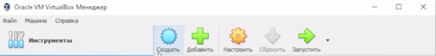{ #fig:001 width=70% height=70% }

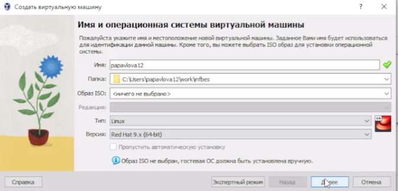{ #fig:002 width=70% height=70% }

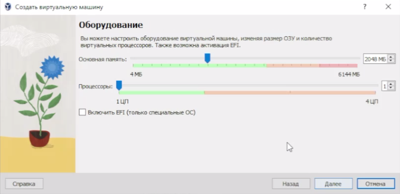{ #fig:003 width=70% height=70% }

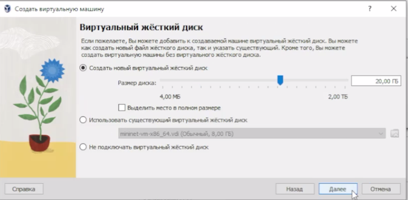{ #fig:004 width=70% height=70% }

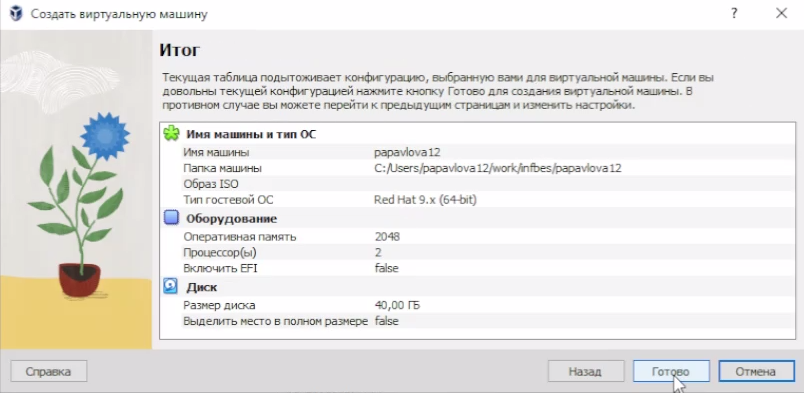{ #fig:005 width=70% height=70% }

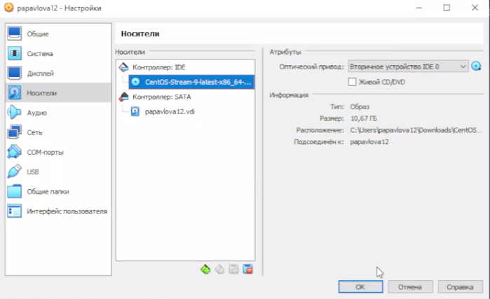{ #fig:006 width=70% height=70% }

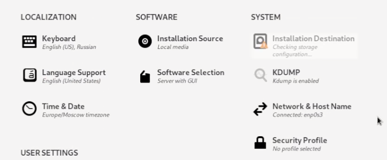{ #fig:007 width=70% height=70% }

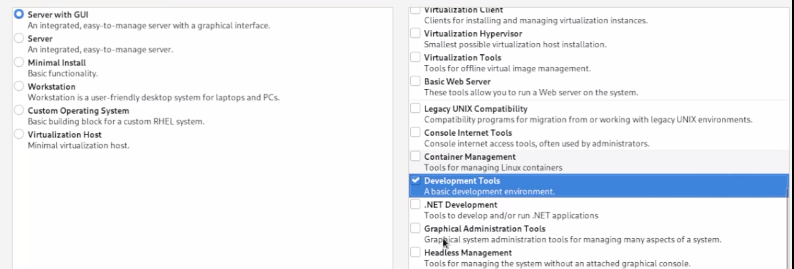{ #fig:008 width=70% height=70% }

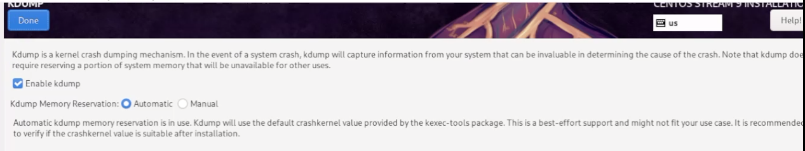{ #fig:009 width=70% height=70% }

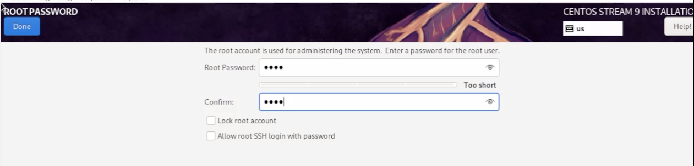{ #fig:010 width=70% height=70% }

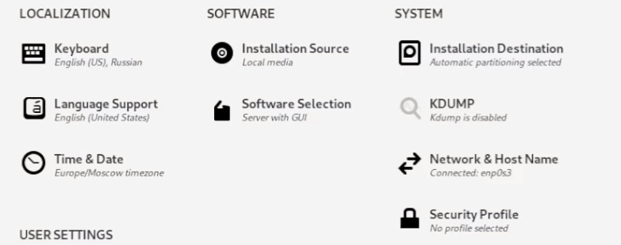{ #fig:011 width=70% height=70% }

{ #fig:012 width=70% height=70% }

### Переход в ОС Linux

{ #fig:013 width=70% height=70% }

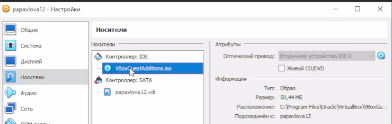{ #fig:014 width=70% height=70% }

# Вывод

## Вывод

- Были настроено рабочее пространство для лабораторных работ, приобретены практические навыки установки операционной системы на виртуальную машину и настройки минимально необходимых для дальнейшей работы сервисов.

# Список литературы. Библиография

[1] Документация по Virtual Box: https://www.virtualbox.org/wiki/Documentation
